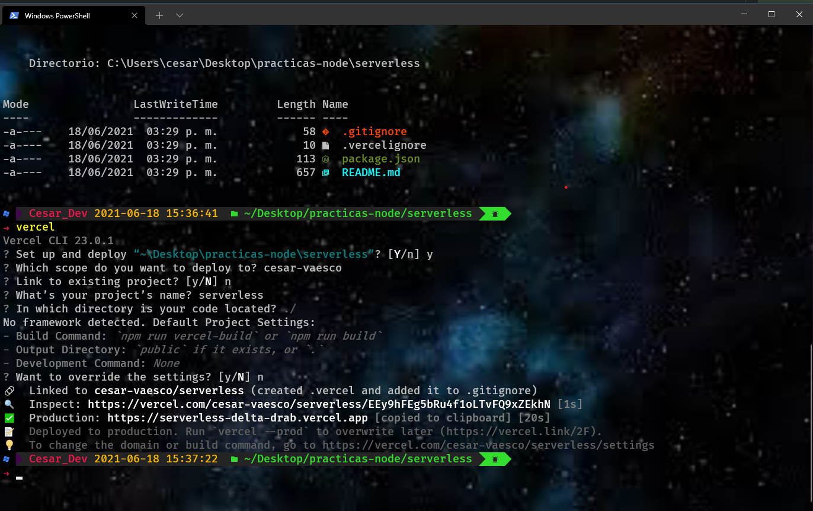

## Inicio de aplicación

- Para desplegar y verificar nuestro avance de código en línea de comando digitar el comando vercel,
  con ello se generaran dos opciones:
  inspect: ver los logs de l ejecución de nustros programás en vercel
  preview: ver en el navegador el avance de nuestra aplicación

- ejemplo inspect: https://vercel.com/**********/serverless/**************************************
- ejemplo preview: https://serverless-h20vyzngq-cesar-vaesco.vercel.app/api/index

#### Descargndo las variables de entorno que se encuntran almacenadas en Vercel

- Se usa el comando  *** vercel env pull ***
- Usar vercel para inicializar nuesra app en modo desarrollo  *** vercel dev ***

| Librería | Sito web | Comando usado para el proyecto | Funcionalidad |
|---|---|---|---|
| express  | https://expressjs.com/es/  | npm install -S express@4.17.1  (instalando versión expecifica)| **** |
| colors  | https://www.npmjs.com/package/colors  | npm i colors| **** |
| mongoose | https://www.npmjs.com/package/mongoose | npm i -S mongoose | Librería que permite la conexión a mongoDB|
| body-parser |https://www.npmjs.com/package/body-parser |  npm i -S body-parser | recoge las peticiones que se hagan del servidor y trasforma las peticiones en formato **json** |
| cors | https://www.npmjs.com/package/cors| npm i -S cors | librería que permite habilitar las peticiones desde url distintas |


## proyecto vercel
****
```
Instalando CLI  - Vercel

    - En el directorio donde queremos iniciar un proyecto con vercel utilizamos el comando -- vercel init --
        Esta opción va a desplegar un menú en el cúal se le podra indicar a vercel en que tipo de proyecto nos podremos
        basar para arrancar nuestro proyecto, para este ejercicio sera custom-build

    - Ya construido el proyecto se genera una carpeta llamada **custom-build** con cuatro archivos iniciales:
        .gitignore - .vercelignore - package.json y README.md

    - La carpeta creada se pude renombrar, para el proyecto la hemos nombrado serverless

```

```
Vincular nuestro proyecto a la nube de Vercel

    - Al ejecutar el comando vercel en línea de comandos se van configuranco opciones que vercel requiere
        para configurar nuestro proycto y poder hostearlo en su nube

```



## Cluster (Agrupación de servidores) en Mongo Atlas
```
 1.- Cuenta en mondo Atlas - https://cloud.mongodb.com/ e inicar sesión para:
 2.- Crear un nuevo cluster
        Para esta app se seleccionaron las siguientes opciones:
            - Cloud Provider: aws
            - Region: N.Virginia
            - Cluster Tier: M0 Sandbox (Shared RAM, 512 MB Storage) Encrypted
        Seleccionadas esas opciones se crea el cluster

3.- Conectar mongo a nuestra api
        ° En la opción conect se despliega la forma en que nos vamos a conectar, para el ejercicio sera a través de la aplicación
        ° Posteriormente se seleccionara la version de node y la cadena de conexión que servira para estructurar la url que nos     ayudara a generar la conexión a la base e datos

** En la opción de databases access se puede configurar un usuario y contraseña para administrar las bases de datos

```


# Custom Build Example

This directory is a brief example of using a Custom Build script that can be deployed with Vercel and zero configuration.

## Deploy Your Own

Deploy your own Custom Built project with Vercel.

[](https://vercel.com/import/project?template=https://github.com/vercel/vercel/tree/main/examples/custom-build)

_Live Example: https://custom-build.now-examples.now.sh_

### How We Created This Example

To get started deploying a Custom Built project with Vercel, you can use the [Vercel CLI](https://vercel.com/download) to initialize the project:

```shell
$ vercel init custom-build
```
